# The Big FFW
The Big FiTS Fibre Wrapper (FFW) allows for the testing of optical fibres for a fully automated optomechanical test facility. Each fibres are individually tested using the ring test method.

 
The Big FFW's codes have been tested with python-2.7, some dependencies are not python-3 ready yet.

## Required packages:

- matplotlib
- numpy
- sys
- PIL
- os
- Tkinter
- ttk
- subprocess
- skimage
- cv2
- astropy
- scipy
- pylab
- lmfit
- random
- imutils
- PyCapture2 (for FLIR cameras)
- time
- Pipython (for PI controller)


This software is compatible with Linux (preferred Ubuntu), Mac OS (10.11<, preferred High Sierra) and Windows (preferred Windows 10)

All those packages can be installed with Pip.

```
pip install <package>...<package>
```
If you have the Python anaconda distribution, you can (except for `vos`) also install the packages not already installed with
```
conda install <package>...<package>
```

Note: You can install Pip on Windows with:

```
curl https://bootstrap.pypa.io/ez_setup.py | python
```
```
curl https://bootstrap.pypa.io/get-pip.py | python
```

You can then clone this repository:
```
git clone https://github.com/UVicOptics/The-Big-FFW.git
cd The-Big-FFW
```

## Hardware:

- An optical fibre
- Pointgrey Camera (parent company FLIR)
  * Model: Grasshoper 2
  * Resolution 2448 x 2048
  * Megapixels: 5.0 MP

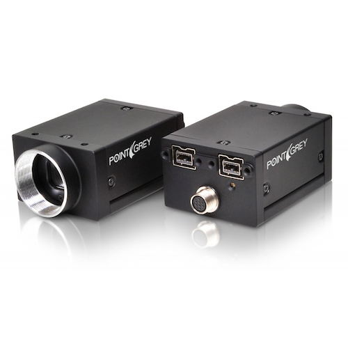

- PC (with an appropriate operating system)
- Source of light (ideally an LED)
- A collimator
  * Thorlab collimator
  * F810SMA-1064
  * NA = 0.25
  * f = 36.60 mm

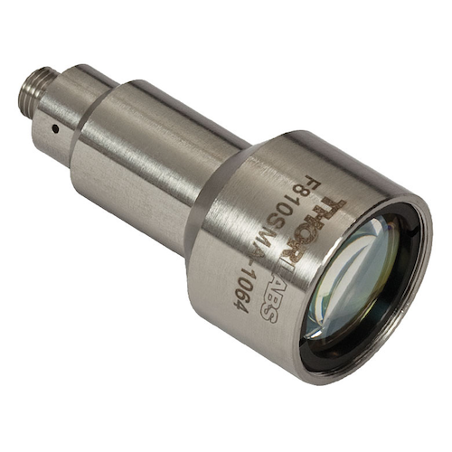


- Multiple mounts and rotating stages

NOTE: In this work we used PI Rotation Stage (M-037 DG), with 2 phase stepper motor drive. Different PI rotation stage with equivalent features can be used.

- PI MicroController
   * C-863 Mercury Servo Controller

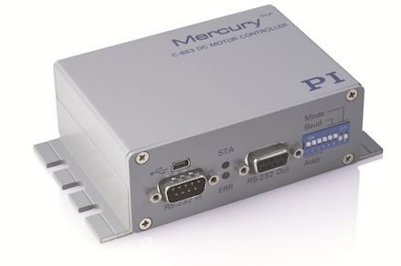

 
# The Big FFW GUI:

- FiTS Analyzer
- Stage Code
- Camera Code
- RAPID

.
.
.
.
.
.

Below is a description of the built-in layers of the Big FFW:

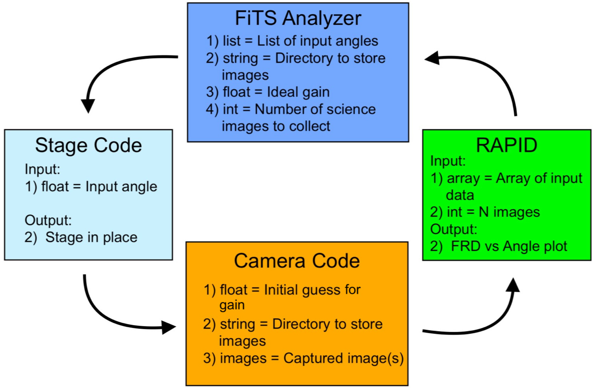

.
.
.
.
.
.
.


## FiTS Analyzer

This is the interface user will use to perform a ring test.

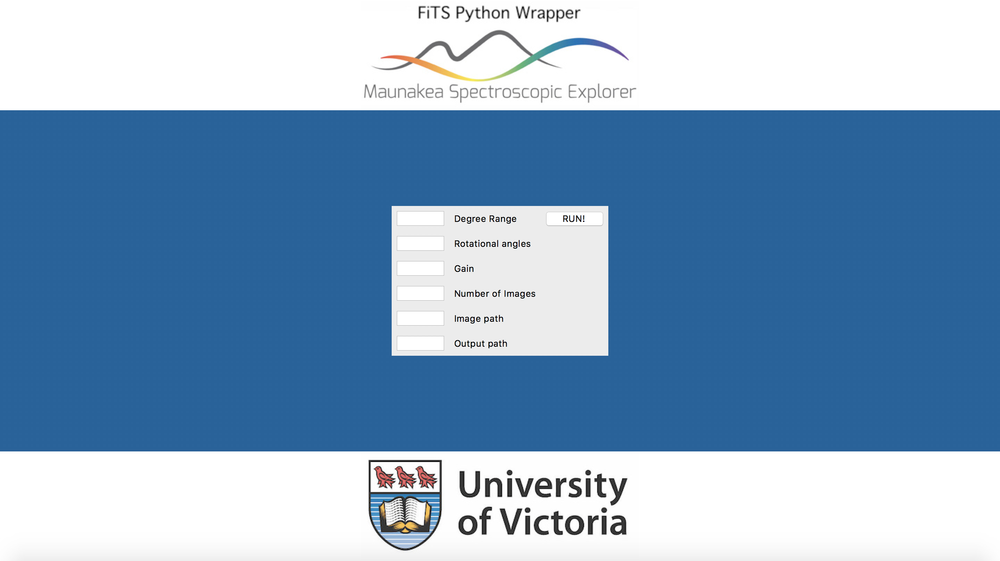

# This GUI requires six variables:

  - Degree Range
     - The stage rotates according to the user's input indegrees (the input format is "#,", i.e. 5,6,7)
     
  - Rotational Angle
     - Each image rotates during the post processing steps so possible non-uniformities in the image can be taken into account.
     
  - Gain
     - An appropriate gain value has to be inserted to help FlyCapture balance the brightness of the rings as the incident angle increases.
     
     NOTE: FlyCapture software can change the exposure time automatically as the incident angle changes.

  - Number of images
  
  - Image path
  
  - Output path
  
     NOTE: The default code uses a fixed path for both Image and Output paths. The exact path can be changed by the user at any time.


## Stage Code

A C-863.11 Physik Instrumente (PI) Mercury controller and a M-037-DG rotational stage were used in this system. The python libraries for operating the controller and stage provided by PI. 

  - Connection
 
     * PI Mercury (C-863.11) can communicate with PC via USB connection or RS-232 cable. 
     
     NOTE: The serial number of the USB has to be updated for each new USB.

## Camera Code

  - FlyCapture
  
     * The Pointgrey Cameras (FLIR) have their own bulit-in software to run the camera
     * This software is open-source and can be downloaded from "https://www.ptgrey.com/flycapture-sdk" or "https://www.ptgrey.com/support/downloads"
     * This software can change the Exposure Time efficiently and automatically to avoid saturation in the image but the Gain has to be fixed by the user for a precise/accurate ring test
    
  - PyCapture
  
     * PyCapture is the official Python library, written by the FLIR group, that can be used to control FlyCapture and ultimately the camera using only Python.
     
     
     NOTE: Detailed documentation for both FlyCapture and PyCapture can be found on "https://www.ptgrey.com/flycapture-sdk"
     


## RAPID

RAPID (Ring Analyzer Python Interface for ring-test Data) is the post processing section of the Big FFW. The Ring test analysis checks the efficiency and quality of optical fibers, but the process can be very time consuming. Using the RAPID graphical user interface, you can analyze and visualize the output ring images from the fiber faster than traditional techniques.

RAPID is invisible to the Big FFW user. However it can be used independently from the Big FFW with the following interface:


# There are 5 variables in RAPID:
* Name = Name of the image file

* Dim1 and Dim2 = The x and y dimensions that cover the diameter of the circle [for the test data in "All" directory, you can use 600 pix and 610 pix to cover the diameter]

* Angle = Rotates the input image by the angle entered by the user in degrees

* Angle_Num = This is different from the "Angle" above. This is the number of angles the program will select at random and input those as "Angle".

# There are 7 functions in RAPID:
* Display: Displays the input image as a whole and also a slice of it based on the Dim1 and Dim2 values.

* Slice: Plots Intensity vs Pixel number graph based on the chosen slice (from Dim1 and Dim2).

* Comparison: Compares the raw data with a smoothed version of it. Currently the default smoothing factor is 20, future versions will allow the user to optimize the smoothing process.

* Peak Finder: Finds peaks in the plot generated from the Slice function.

* FWHM, Diameter, FRD Finder: Determines the diameter of the circle (in pixels), fits a spline polynomial to the distribution of the light (gaussian), calculates the Full Width Half Maximum (FWHM) of the distirbution. The Focal Ratio Degradation (FRD) of the ring is calculated as the ratio of 1/e^2 over diameter (see figure below). 

* Calibrate: Rotates the image several times with random angles and determines FWHM, Diameter, and FRD of the system. Standard deviations are determined from these measurments.

* Show All - Recalculates the FRD from all the previous measurements and plots FRD vs angle. Note that for this function the "Name" variable becomes the directory name for all the measurements (i.e. all measurements need to be in the same directory).

# Run the code
         -python RingTest.py

# Output


The seven functions in RAPID produce the following outputs:

### "Display":

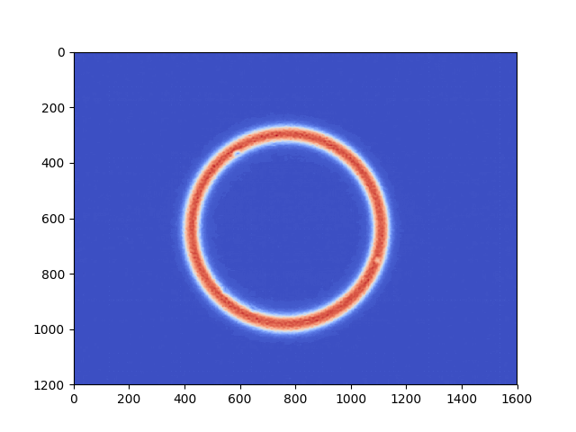

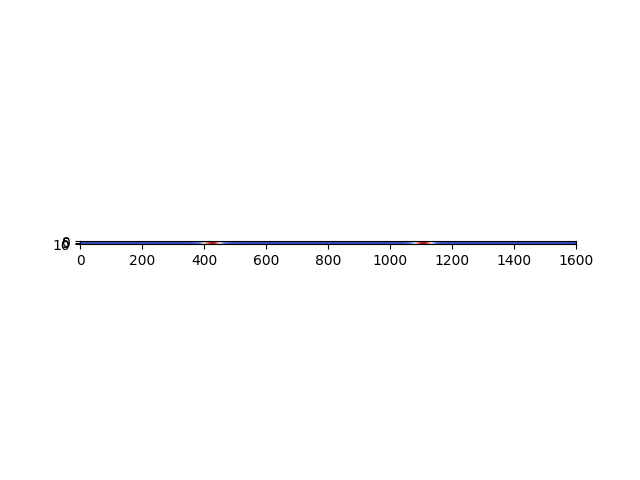

### "Slice":

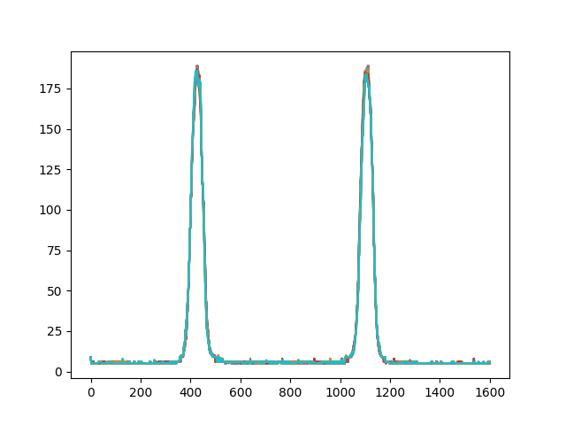

### "Comparison":

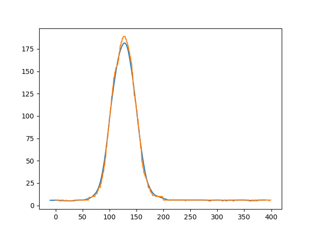

### "Peak Finder":


### "FWHM, Radius, FRD Finder":

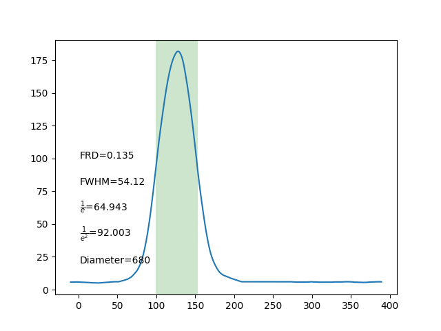

### "Calibrate":

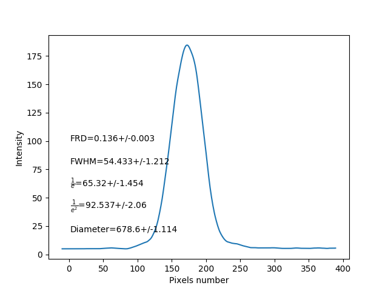

### "Show All":

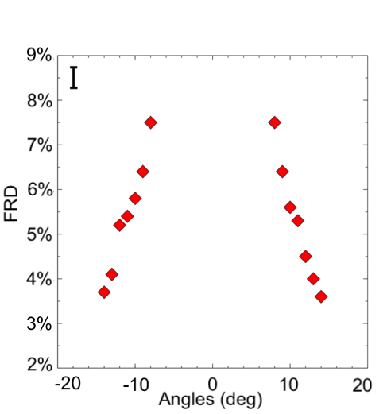

# In addition:

The angles can be converted to the f/# as 1/2tan(angle). Note that the error bar is added by hand.

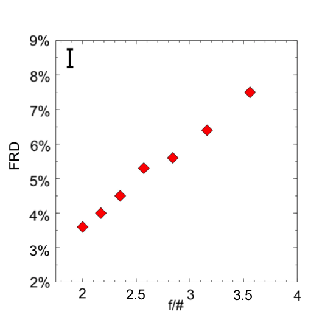


Comparison between The Big FFW's results and manual results (i.e. from measurement by the UVic's FiTS team using independent software such as LaseView):

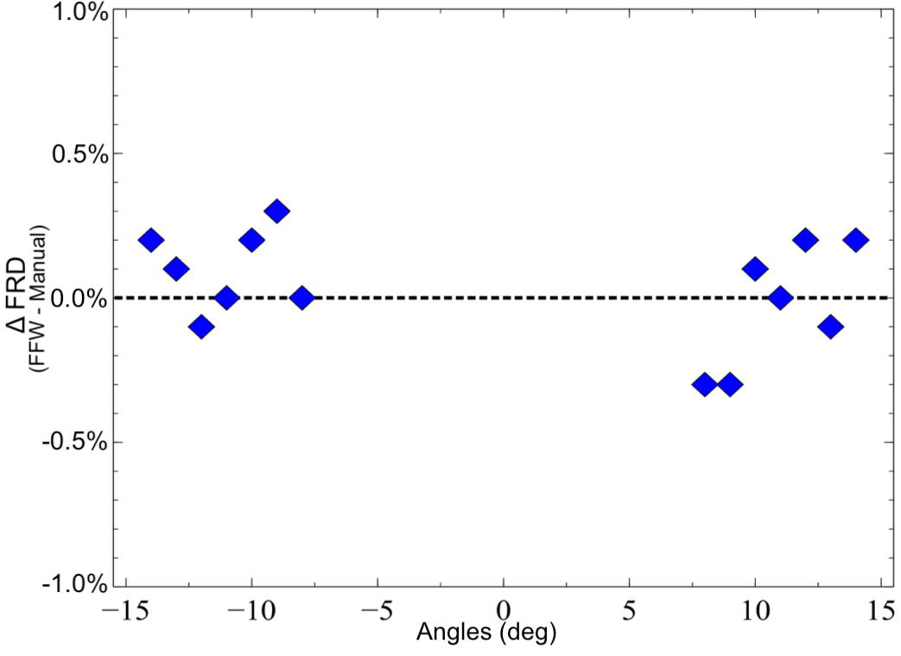

