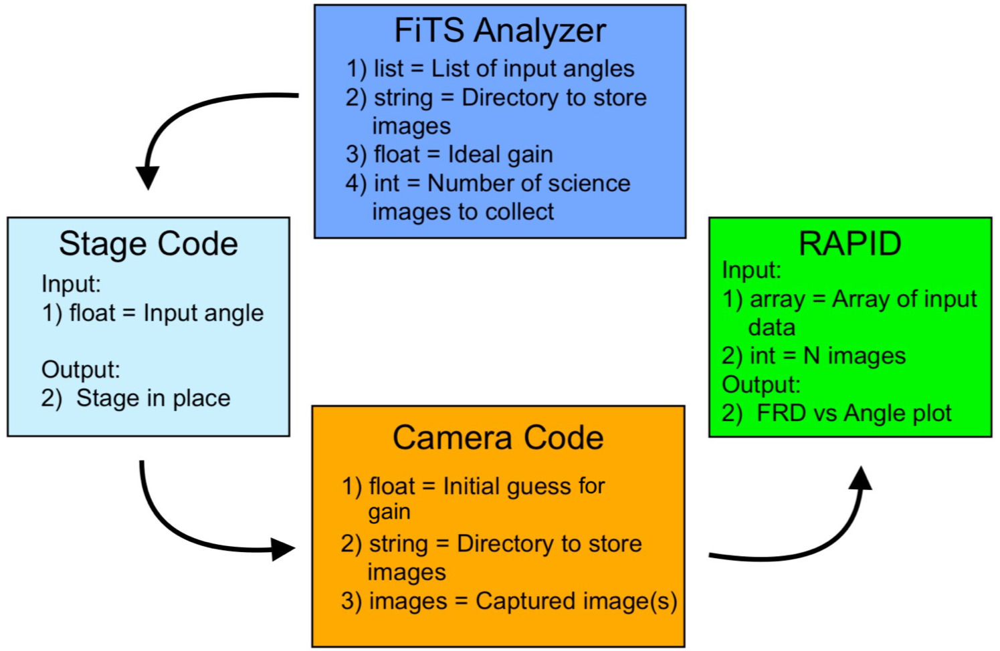

# The Big FFW
This system allows for the testing of optical fibres for a fully automated optomechanical test facility. Each fibres are individually tested using the ring test method.

 
They have been tested with python-2.7, some dependencies are not python-3 ready yet.

## Required packages:

- matplotlib
- numpy
- sys
- PIL
- os
- Tkinter
- ttk
- subprocess
- skimage
- cv2
- astropy
- scipy
- pylab
- lmfit
- random
- imutils
- PyCapture2 (for FLIR cameras)
- time
- Pipython (for PI controller)


This software is compatible with Linux (preferred Ubuntu), Mac OS (10.11<, preferred High Sierra) and Windows (preferred Windows 10)

All those packages can be installed with Pip.

```
pip install <package>...<package>
```
If you have the Python anaconda distribution, you can (except for `vos`) also install the packages not already installed with
```
conda install <package>...<package>
```

Note: You can install Pip on Windows with:

```
curl https://bootstrap.pypa.io/ez_setup.py | python
```
```
curl https://bootstrap.pypa.io/get-pip.py | python
```

You can then clone this repository:
```
git clone https://github.com/UVicOptics/The-Big-FFW.git
cd The-Big-FFW
```

## Hardware:

- An optical fibre
- Pointgrey Camera
  * Model: Grasshoper 2
  * Resolution 2448 x 2048
  * Megapixels: 5.0 MP


- PC (with an appropriate operating system)
- Source of light (ideally an LED)
- A collimator
  * Thorlab collimator
  * F810SMA-1064
  * NA = 0.25
  * f = 36.60 mm


- Multiple mounts and rotating stages

NOTE: In this work we used PI Rotation Stage (M-037 DG), with 2 phase stepper motor drive. Different PI rotation stage with equivalent features can be used.

- PI MicroController
   * C-863 Mercury Servo Controller


 
# The Big FFW GUI:


.
.
.
.
.
.
Below is a description of the built-in layers of the Big FFW:


.
.
.
.
.
.
.

- FiTS Analyzer
- Stage Code
- Camera Code
- RAPID


## FiTS Analyzer

This is the interface user will use to perform a ring test. This GUI requires six variables to run:

  - Degree Range
     * The stage rotates with respect to the user's input degrees (the input format is "#,", i.e. 5,6,7)
     
  - Rotational Angle
     * Each image rotates during the post processing steps so possible non-uniformities in the image can be taken into account.
     
  - Gain
     * An appropriate gain value has to be inserted to help FlyCapture balance the brightness of the rings as the incident angle increases.
     
     NOTE: FlyCapture software can change the exposure time automatically as the incident angle changes.

  - Number of images
  - Image path
  - Output path
  
     NOTE: The default code uses a fixed path for both Image and Output paths. The exact path can be changed by the user at any time.


## Stage Code

A C-863.11 Physik Instrumente Mercury controller and a M-037-DG rotational stage were used in this system. The python libraries for operating the controller and stage provided by the Physik Instrumente. 

  - Connection
 
     * PI Mercury (C-863.11) can communicate with PC via USB connection or RS-232 cable. 
     
     NOTE: The serial number of the USB has to be updated for each new USB.

## Camera Code

  - FlyCapture
  
     * FLIR cameras have their own bulit-in software to run the camera
     * This software is open-source and can be downloaded from "https://www.ptgrey.com/flycapture-sdk" or "https://www.ptgrey.com/support/downloads"
     * This software can efficiently and automatically change the Exposure Time to avoid saturation in the image but the Gain has to be fixed by the user for a precise/accurate ring test
    
  - PyCapture
  
     * PyCapture is the official Python library, written by the FLIR group, that can be used to control FlyCapture and ultimately the camera using only Python.
     
     
     NOTE: Detailed documentation for both FlyCapture and PyCapture can be found on "https://www.ptgrey.com/flycapture-sdk"
     


## RAPID

Ring Analyzer Python Interface for ring-test Data or RAPID is the post processing section of the Big FFW. In general, Ring test analysis is an essential way of checking efficiency and quality of optical fibers but the process can be very time consuming. By RAPID graphical user interface, you can analyze and visualize the output ring images of the fiber significantly faster than traditional techqniques.

The RAPID can also be used indepentely from the Big FFW with the following interface:


# There are 5 variables in the main page of the interface:
* Name = Name of the image file

* Dim1 and Dim2 = The x and y dimensions that cover the diameter of the circle [for the test data in "All" directory, you can use 600 pix and 610 pix to cover the diameter]

* Angle = Rotates the input image with respect to the angle the user enters

* Angle_Num = Rotates the image this many times with respect to the random angles

# There are 7 functions in the main page of the interface:
* Display: Displays the input image as a whole and also a slice of it based on the Dim1 and Dim2 values.

* Slice: Plots Intensity Vs Pixel number graph based in the chosen slice (from Dim1 and Dim2).

* Comparison: Compares the raw data with the smoothed version of it.

* Peak Finer: Finds peaks of the plot generated from Slice functions.

* FWHM, Diameter, FRD Finder: Determines the diameter of the circle (in pixels), fits a spline polynomial to the gaussians and calculates the Full Width Half Maximum (FWHM) and also the Focal Ratio Degradation (FRD) of the ring. 

* Calibrate - FWHM, Radius, FRD Finder: Rotates the image several times with random angles and determines FWHM, Diameter and FRD Finder of the system (this time with standard deviation from several measurments).

* Show All - Determines FRD of multiple rings in multiple files and plots a graph of FRD Vs angle of all rings (note that for this function, name of the directory should be entered in the corresponding space).

# Run the code
         -python RingTest.py

# Output


* Different functions are as following:

"Display":


"Slice":


"Comparison":


"Peak Finder":


"FWHM, Radius, FRD Finder":


"Calibrate - FWHM, Radius, FRD Finder":


"Show All" + other results:


Comparison between The Big FFW's results and manual results using independant methods:


